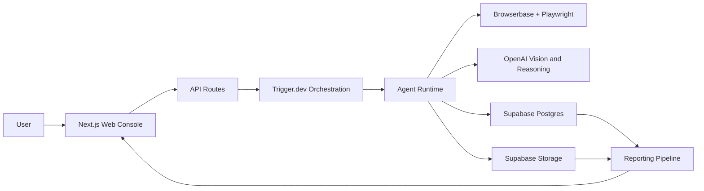

# Chaos Swarm Architecture

## Overview

Chaos Swarm is organized as a layered browser-testing platform. The system separates the control plane, the agent runtime, the browser execution plane, the data plane, and the reporting layer. This separation keeps the product modular: the browser provider can change without rewriting the UI, the model provider can change without rewriting storage, and the report renderer can evolve without touching execution logic.

The MVP architecture is optimized for fast validation and clear observability. A user creates a run from the web app, the orchestration layer fans out multiple agents, each agent opens an isolated browser context in the cloud, and the reporting layer composes the resulting telemetry into actionable artifacts.

## Current Implementation Snapshot

The live system now has two materially different execution postures:

- Local development can run with direct Playwright on the workstation.
- Public deployed runs can execute through Browserbase-backed cloud sessions.

The active AI-native path today is:

1. Scenario intake
   Built-in demos use stored scenario profiles; custom runs can be AI-compiled from `URL + goal`.
2. Step reasoning
   The model sees the current screenshot, visible targets, screen-space candidate boxes, recent history, persona, and playbook.
3. Step execution
   The runtime executes the chosen action visually first, then may use DOM recovery unless strict visual mode disables it.
4. Step interpretation
   A second model pass decides current stage, goal status, plain-language step outcome, and bilingual explanations.
5. Aggregate reporting
   The reporting package still computes EFI, funnels, and failure clusters largely from deterministic aggregation logic.

That means the system is already model-driven at the step level, but not yet fully model-native at the aggregate interpretation layer.

## High-Level Diagram

## Layers

### Web Console

The web console is the human control surface. It creates runs, shows live progress, and renders final reports. In the MVP it is a public demo app with no authentication.

### API Layer

The API layer exposes run creation, run status, event streaming, and report retrieval. It acts as the boundary between the UI and the execution backend.

### Orchestration Layer

Trigger.dev owns long-running work. It schedules swarm runs, controls concurrency, retries failed jobs, and coordinates agent steps. This is the right place for background execution because runs may take long enough to exceed a normal request lifecycle.

### Agent Runtime

The agent runtime is responsible for the decision loop:

1. Perceive the page.
2. Evaluate the task state.
3. Emote based on friction.
4. Act with the safest available interaction method.

The runtime also normalizes outputs into structured events so that reporting is deterministic.

### Browser Execution Layer

Browserbase hosts remote browser sessions and Playwright drives them. Every agent should get an isolated browser context so that cookies, session state, and side effects do not leak across agents.

### Data Layer

Supabase provides the persistent store for runs, agents, events, artifacts, and reports. Storage holds screenshots, traces, and highlight clips. Realtime can stream run progress to the UI.

### Reporting Layer

The reporting layer converts event sequences into human-readable diagnostics. It computes friction metrics, builds heatmaps, constructs drop-off funnels, and produces a narrative summary.

## Core Data Model

### Run

Represents a single swarm execution.

Key fields:

- `id`
- `targetUrl`
- `goal`
- `agentCount`
- `personaMix`
- `status`
- `createdAt`
- `completedAt`

### Agent

Represents one synthetic user in one run.

Key fields:

- `id`
- `runId`
- `persona`
- `seed`
- `status`
- `stepCount`
- `finalOutcome`

### Event

Represents a single observed action or state transition.

Key fields:

- `runId`
- `agentId`
- `stepIndex`
- `timestamp`
- `url`
- `actionType`
- `targetHint`
- `x`
- `y`
- `latencyMs`
- `frustrationScore`
- `outcome`

### Artifact

Represents a stored binary or derived output.

Key fields:

- `runId`
- `type`
- `storageKey`
- `metadata`

### Report

Represents the final rendered diagnosis package.

Key fields:

- `runId`
- `efi`
- `heatmap`
- `funnel`
- `clusters`
- `summary`

## Request Flow

1. A user submits a run from the web console.
2. The API validates the target URL, task goal, and execution settings.
3. Trigger.dev starts a swarm job and fans out agent tasks.
4. Each agent opens an isolated browser context.
5. The agent perceives the page using screenshots and page metadata.
6. The model proposes a next action and updates the frustration state.
7. Playwright executes the action through locators, keyboard input, mouse input, or coordinate fallback.
8. The runtime records an event and uploads artifacts.
9. After all agents finish, the reporting pipeline aggregates the data.
10. The web console renders the final report.

## Hybrid Browser Strategy

Chaos Swarm uses a hybrid browser strategy by design.

- Visual inputs explain layout, hierarchy, occlusion, and perceived affordance.
- DOM and accessibility information ground element selection and improve execution stability.
- Locator-based actions are preferred because they are deterministic and inspectable.
- Coordinate clicks are fallback behavior, not the primary control path.

This hybrid model matters because the product is not just trying to click through pages. It is trying to explain friction. Pure DOM automation misses perceived friction. Pure vision misses stability. The hybrid approach keeps both.

The current runtime is therefore best described as:

- visual-first for perception and action choice
- hybrid for execution stability
- transparent about recovery through visual purity and DOM assist metrics

This is intentionally more honest than claiming a pure-vision system while silently leaning on structure.

## Extensibility Points

### Model Providers

The model adapter should be replaceable. The runtime should accept a provider interface for page understanding, action ranking, and narrative generation.

### Browser Providers

Browserbase is the default cloud browser provider for the MVP, but the execution interface should not assume it forever. The browser layer should be thin and provider-agnostic.

### Report Renderers

The report system should emit structured data first and render formats second. Markdown, JSON, and later HTML or PDF outputs should all come from the same report model.

### Scoring

EFI computation should live in its own package so the scoring model can evolve without changing execution code.

## Non-Functional Requirements

### Reliability

- Runs must fail loudly and produce partial artifacts when possible.
- Agent steps should be idempotent where practical.
- Network and browser failures need retries with bounded backoff.

### Performance

- The MVP should favor fast first result over maximum scale.
- Concurrency should be capped by environment and provider limits.
- Artifact upload should be asynchronous where possible.

### Observability

- Every action should be traceable back to a run and an agent.
- Frustration updates must be logged with the event stream.
- Failure summaries should be explainable from underlying events.

### Security

- Credentials should never be committed to the repository.
- Targets should be constrained by explicit allowlists.
- The system should avoid interacting outside the declared scope of a run.

## Deployment Model

The expected MVP deployment is:

- `Next.js` on Vercel for the web console
- `Trigger.dev` cloud for background work
- `Supabase` for persistence and artifacts
- `Browserbase` for cloud browser sessions

This split keeps the app simple to operate and keeps the heavy execution workload outside the web server process.

## Evolution Strategy

The architecture should evolve in layers, not through a rewrite. New personas should only extend the agent runtime. New report types should only extend the reporting package. New execution providers should only extend the browser adapter. The core principle is that the system should remain composable even as it grows from a demo into a product.

## Remaining Deterministic Islands

The main non-AI-native areas still left in the stack are:

- candidate extraction and ranking before model selection
- hand-authored built-in scenario definitions
- deterministic funnel assembly and failure clustering
- heuristic EFI component scoring
- deterministic persona scaffolding and guardrails

These are the next places to remove hand-written assumptions while preserving debuggability and trust.
